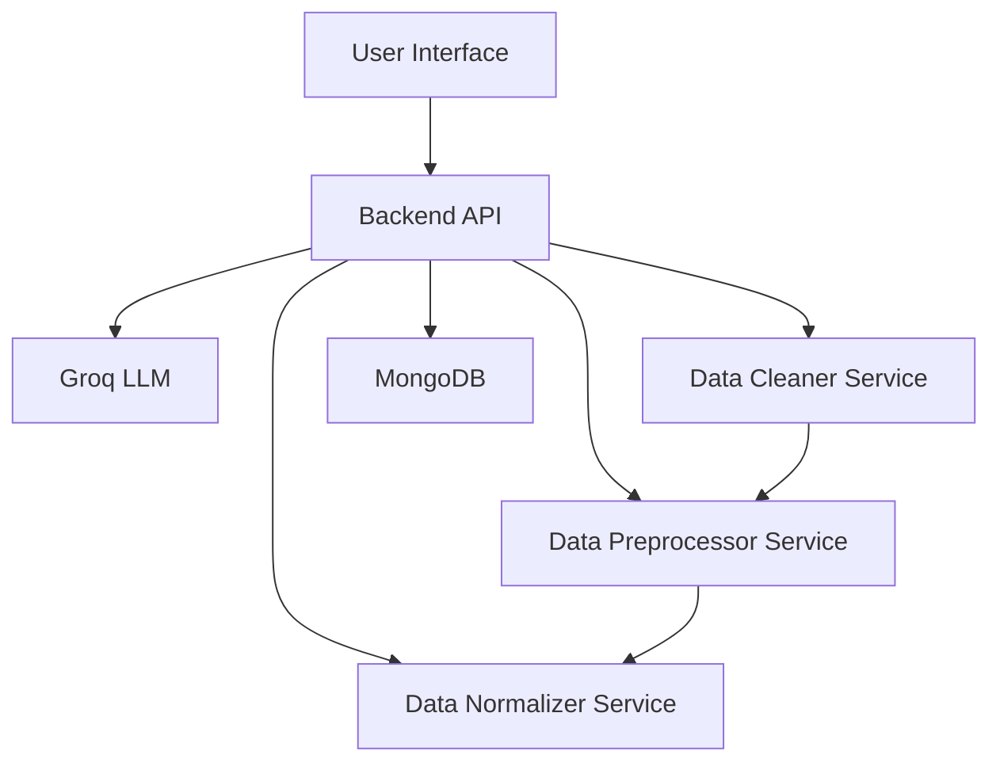
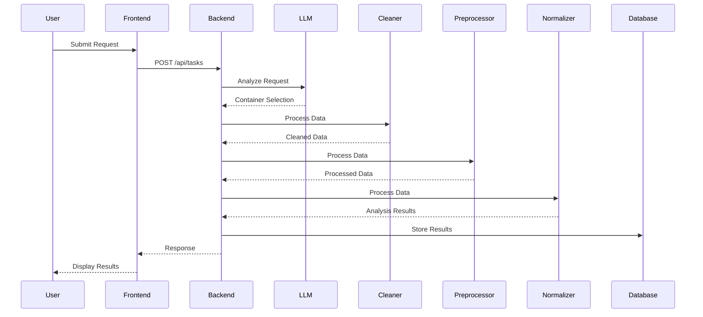
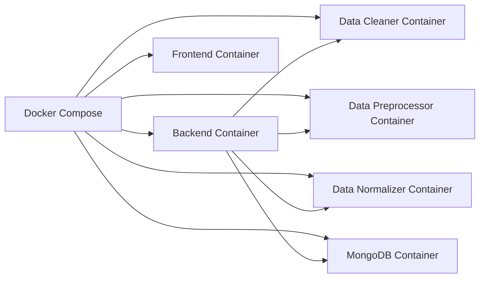
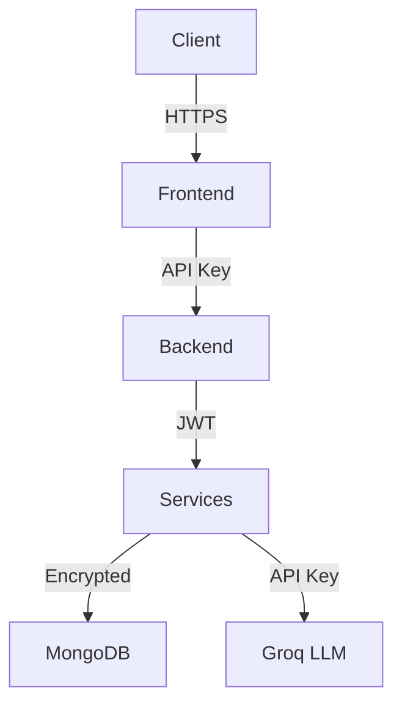
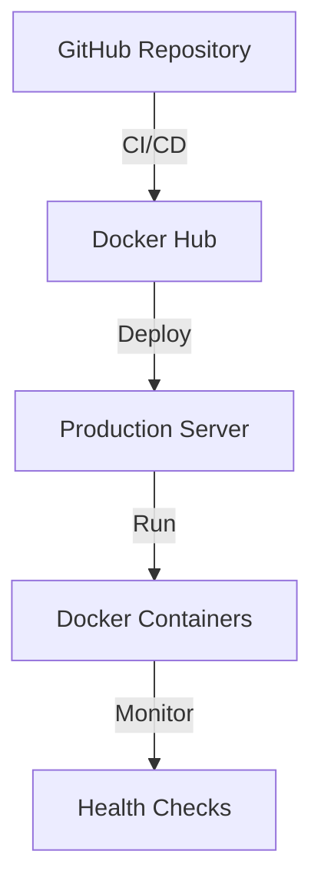

# System Architecture Documentation

## 1. High-Level Architecture



## 2. Component Details

### 2.1 Frontend Layer
- **Technology**: React with Chakra UI
- **Responsibilities**:
  - User interface rendering
  - Input validation
  - Real-time updates
  - Error handling
  - Responsive design

### 2.2 Backend Layer
- **Technology**: Node.js with Express
- **Responsibilities**:
  - Request handling
  - Container orchestration
  - Data persistence
  - Error management
  - API endpoints

### 2.3 AI Layer
- **Technology**: Groq LLM API
- **Responsibilities**:
  - Task analysis
  - Container selection
  - Decision making
  - Pattern recognition

### 2.4 Microservices Layer
1. **Data Cleaner Service**
   - Input validation
   - Data parsing
   - Format standardization
   - Error handling

2. **Data Preprocessor Service**
   - Data categorization
   - Pattern recognition
   - Data transformation
   - Validation

3. **Data Normalizer Service**
   - Data analysis
   - Insight generation
   - Report formatting
   - Result aggregation

### 2.5 Data Layer
- **Technology**: MongoDB
- **Responsibilities**:
  - Data persistence
  - Query handling
  - Data validation
  - Backup management

## 3. Data Flow



## 4. Container Orchestration



## 5. Security Architecture



## 6. Deployment Architecture



## 7. Technical Specifications

### 7.1 API Endpoints
```yaml
/api/tasks:
  POST:
    - Description: Process new transaction data
    - Input: Transaction data in specified format
    - Output: Processed analysis with insights
  GET:
    - Description: Retrieve processing history
    - Output: List of processed tasks with results
```

### 7.2 Data Models
```javascript
Task Schema:
{
  request: String,
  status: String,
  result: String,
  createdAt: Date
}
```

### 7.3 Environment Variables
```yaml
Required Variables:
  - MONGODB_URI: MongoDB connection string
  - GROQ_API_KEY: Groq API key
  - PORT: Server port
  - DATA_CLEANER_PORT: Data cleaner service port
  - DATA_PREPROCESSOR_PORT: Data preprocessor service port
  - DATA_NORMALIZER_PORT: Data normalizer service port
  - DOCKER_NETWORK: Docker network name
```

## 8. Performance Considerations

1. **Load Balancing**
   - Container scaling
   - Request distribution
   - Resource optimization

2. **Caching**
   - Response caching
   - Data caching
   - Session management

3. **Monitoring**
   - Health checks
   - Performance metrics
   - Error tracking

## 9. Scalability Features

1. **Horizontal Scaling**
   - Container replication
   - Load distribution
   - Resource allocation

2. **Vertical Scaling**
   - Resource optimization
   - Performance tuning
   - Memory management

3. **Database Scaling**
   - Sharding
   - Replication
   - Indexing

## 10. Disaster Recovery

1. **Backup Strategy**
   - Regular backups
   - Data replication
   - Recovery procedures

2. **Failover**
   - Service redundancy
   - Automatic recovery
   - Data consistency

3. **Monitoring**
   - Alert system
   - Log management
   - Performance tracking 